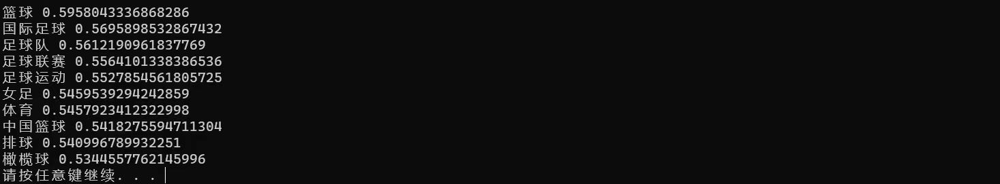
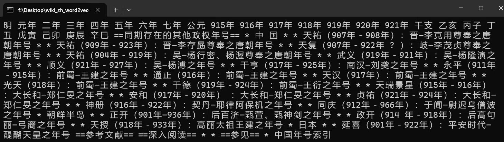

# 构建Wiki中文语料词向量模型(python3)

>本实例主要介绍的是选取wiki中文语料，并使用python3完成Word2vec模型构建的实践过程，不包含原理部分，旨在一步一步的了解自然语言处理的基本方法和步骤。文章主要包含了开发环境准备、数据的获取、数据的预处理、模型构建和模型测试四大内容，对应的是实现模型构建的五个步骤。

## 一、 开发环境准备
笔者使用的是anaconda环境下的python 3.10.13。
## 二、Wiki数据获取
#### 2.1  Wiki中文数据的下载
到wiki官网下载中文语料，下载完成后会得到命名为zhwiki-latest-pages-articles.xml.bz2的文件，大小约为2.56G，里面是一个XML文件。
下载地址如下：https://dumps.wikimedia.org/zhwiki/latest/zhwiki-latest-pages-articles.xml.bz2
#### 2.2  将XML的Wiki数据转换为text格式
###### （1）python实现
编写python程序将XML文件转换为text格式，使用到了gensim.corpora中的WikiCorpus函数来处理维基百科的数据。python代码实现如下所示，文件命名为1_process.py。
```python
#将xml的wiki数据转换为text格式

"""
This script converts XML wiki data to text format.
"""

import logging
import os.path
import sys

from gensim.corpora import WikiCorpus
from nltk.stem import WordNetLemmatizer
from nltk.tokenize import word_tokenize
import nltk

def lemmatize(text, tokens, lemmatize, lowercase):
lemmatizer = WordNetLemmatizer()
return [lemmatizer.lemmatize(word) for word in word_tokenize(text)]

if __name__ == '__main__':
    nltk.download('wordnet')
    nltk.download('omw-1.4')
    
    program = os.path.basename(sys.argv[0])#得到文件名
    logger = logging.getLogger(program)

    logging.basicConfig(format='%(asctime)s: %(levelname)s: %(message)s')
    logging.root.setLevel(level=logging.INFO)
    logger.info("running %s" % ' '.join(sys.argv))

    if len(sys.argv) < 3:
        print (globals()['__doc__'] % locals())
        sys.exit(1)

    inp, outp = sys.argv[1:3]
    space = " "
    i = 0

    output = open(outp, 'w', encoding='utf-8')
    wiki =WikiCorpus(inp, tokenizer_func=lemmatize, dictionary=[])#gensim里的维基百科处理类WikiCorpus
    for text in wiki.get_texts():#通过get_texts将维基里的每篇文章转换位1行text文本，并且去掉了标点符号等内容
        output.write(space.join(text) + "\n")
        i = i+1
        if (i % 10000 == 0):
            logger.info("Saved "+str(i)+" articles.")

    output.close()
    logger.info("Finished Saved "+str(i)+" articles.")
```
###### （2）运行程序文件
在代码文件夹下运行如下anaconda prompt命令行，即可得到转换后生成的文件wiki.zh.txt。

        python 1_process.py zhwiki-latest-pages-articles.xml.bz2 wiki.zh.txt

###### （3）得到运行结果



由结果可知，95分钟运行完成911348篇文章，得到一个2.38G的txt文件。

## 三、Wiki数据预处理
#### 3.1  中文繁体替换成简体
Wiki中文语料中包含了很多繁体字，需要转成简体字再进行处理，这里使用到了OpenCC工具进行转换。

###### （1）安装OpenCC
使用pip install opencc-python进行安装。

###### （2）使用OpenCC进行繁简转换
```python
from opencc import OpenCC
# 初始化转换器，t2s表示从繁体转简体
cc = OpenCC('t2s')
# 打开简体中文文档进行写入
with open('wiki.zh.simp.txt', 'w', encoding='utf-8') as out_f:
    # 分批读取繁体中文文档
    with open('wiki.zh.txt', 'r', encoding='utf-8') as in_f:
        for line in in_f:
            # 转换为简体中文
            simplified_chinese = cc.convert(line)
            # 写入简体中文
            out_f.write(simplified_chinese)
```
###### （3）结果查看
转化后的txt文件有2.38G，用记事本和vscode无法打开，所以采用python自带的IO进行读取。Python代码如下：
```python
import codecs,sys
f = codecs.open('wiki.zh.simp.txt','r',encoding="utf8")
line = f.readline()
print(line)
```

#### 3.2  结巴分词
本例中采用结巴分词对字体简化后的wiki中文语料数据集进行分词，在执行代码前需要安装jieba模块。由于此语料已经去除了标点符号，因此在分词程序中无需进行清洗操作，可直接分词。若是自己采集的数据还需进行标点符号去除和去除停用词的操作。
Python实现代码如下：
```python
#逐行读取文件数据进行jieba分词

import jieba
import jieba.analyse
import jieba.posseg as pseg #引入词性标注接口 
import codecs,sys


if __name__ == '__main__':
    f = codecs.open('wiki.zh.simp.txt', 'r', encoding='utf8')
    target = codecs.open('wiki.zh.simp.seg.txt', 'w', encoding='utf8')
    print ('open files.')

    lineNum = 1
    line = f.readline()
    while line:
        print ('---processing ',lineNum,' article---')
        seg_list = jieba.cut(line,cut_all=False)
        line_seg = ' '.join(seg_list)
        target.writelines(line_seg)
        lineNum = lineNum + 1
        line = f.readline()

    print ("well done.")
    f.close()
    target.close()
 ```       
代码执行完成后得到一个3.01G大小的文档wiki.zh.simp.seg.txt。分词结果截图如下所示：


#### 3.3 去除非中文字符

```python
import re

# 定义一个函数来过滤非中文字符，并将一连串的非中文字符替换为单个空格
def filter_non_chinese(text):
    # 正则表达式匹配一连串的非中文字符，[\u4e00-\u9fa5]是中文字符的Unicode范围
    # 使用re.sub替换一连串的非中文字符为一个空格
    filtered_text = re.sub(r'[^\u4e00-\u9fa5]+', ' ', text)
    return filtered_text

# 打开原始文件和目标文件
with open('wiki.zh.simp.txt', 'r', encoding='utf-8') as source_file, \
     open('wiki.zh.simp.seg.only_chinese.txt', 'w', encoding='utf-8') as target_file:
    # 逐行读取和处理
    for line in source_file:
        # 过滤当前行的非中文字符，并将一连串的非中文字符替换为单个空格
        filtered_line = filter_non_chinese(line)
        # 将处理后的行写入新文件
        target_file.write(filtered_line + '\n')  # 添加换行符以保持原有的行结构
```

## 四、Word2Vec模型训练
######  （1）word2vec模型实现
分好词的文档即可进行word2vec词向量模型的训练了。文档较大，需要用内存为8G或16G的电脑来跑。具体Python代码实现如下所示，文件命名为3_train_word2vec_model.py。
```python
#使用gensim word2vec训练脚本获取词向量

import warnings
warnings.filterwarnings(action='ignore', category=UserWarning, module='gensim')# 忽略警告

import logging
import os.path
import sys
import multiprocessing

from gensim.corpora import WikiCorpus
from gensim.models import Word2Vec
from gensim.models.word2vec import LineSentence


if __name__ == '__main__':

    program = os.path.basename(sys.argv[0])
    logger = logging.getLogger(program)

    logging.basicConfig(format='%(asctime)s: %(levelname)s: %(message)s',level=logging.INFO)
    logger.info("running %s" % ' '.join(sys.argv))

    # inp为输入语料, outp1 为输出模型, outp2为原始c版本word2vec的vector格式的模型
    
    inp =  'wiki.zh.simp.seg.only_chinese.txt'
    outp1 = 'wiki.zh.text.model'
    outp2 = 'wiki.zh.text.vector'

    # 训练skip-gram模型
    model = Word2Vec(LineSentence(inp),  vector_size=400, window=5, min_count=5,
                     workers=multiprocessing.cpu_count())

    # 保存模型
    model.save(outp1)
    model.wv.save_word2vec_format(outp2, binary=False)
```
###### （2）运行结果查看

        2023-12-21 22:18:08,959: INFO: EPOCH 4 - PROGRESS: at 97.67% examples, 1161152 words/s, in_qsize 0, out_qsize 0
        2023-12-21 22:18:09,949: INFO: EPOCH 4 - PROGRESS: at 98.19% examples, 1161166 words/s, in_qsize 0, out_qsize 0
        2023-12-21 22:18:10,954: INFO: EPOCH 4 - PROGRESS: at 98.62% examples, 1161167 words/s, in_qsize 1, out_qsize 1
        2023-12-21 22:18:11,969: INFO: EPOCH 4 - PROGRESS: at 99.08% examples, 1161201 words/s, in_qsize 0, out_qsize 2
        2023-12-21 22:18:12,985: INFO: EPOCH 4 - PROGRESS: at 99.57% examples, 1161201 words/s, in_qsize 0, out_qsize 2
        2023-12-21 22:18:13,829: INFO: EPOCH 4: training on 341900989 raw words (304853155 effective words) took 262.5s, 1161367 effective words/s
        2023-12-21 22:18:13,829: INFO: Word2Vec lifecycle event {'msg': 'training on 1709504945 raw words (1524238644 effective words) took 1325.4s, 1150013 effective words/s', 'datetime': '2023-12-21T22:18:13.829158', 'gensim': '4.3.0', 'python': '3.10.13 | packaged by Anaconda, Inc. | (main, Sep 11 2023, 13:24:38) [MSC v.1916 64 bit (AMD64)]', 'platform': 'Windows-10-10.0.22000-SP0', 'event': 'train'}
        2023-12-21 22:18:13,829: INFO: Word2Vec lifecycle event {'params': 'Word2Vec<vocab=828204, vector_size=400, alpha=0.025>', 'datetime': '2023-12-21T22:18:13.829158', 'gensim': '4.3.0', 'python': '3.10.13 | packaged by Anaconda, Inc. | (main, Sep 11 2023, 13:24:38) [MSC v.1916 64 bit (AMD64)]', 'platform': 'Windows-10-10.0.22000-SP0', 'event': 'created'}
        2023-12-21 22:18:13,829: INFO: Word2Vec lifecycle event {'fname_or_handle': 'wiki.zh.text.model', 'separately': 'None', 'sep_limit': 10485760, 'ignore': frozenset(), 'datetime': '2023-12-21T22:18:13.829158', 'gensim': '4.3.0', 'python': '3.10.13 | packaged by Anaconda, Inc. | (main, Sep 11 2023, 13:24:38) [MSC v.1916 64 bit (AMD64)]', 'platform': 'Windows-10-10.0.22000-SP0', 'event': 'saving'}
        2023-12-21 22:18:13,841: INFO: storing np array 'vectors' to wiki.zh.text.model.wv.vectors.npy
        2023-12-21 22:18:14,584: INFO: storing np array 'syn1neg' to wiki.zh.text.model.syn1neg.npy
        2023-12-21 22:18:15,410: INFO: not storing attribute cum_table
        2023-12-21 22:18:15,948: INFO: saved wiki.zh.text.model
        2023-12-21 22:18:16,616: INFO: storing 828204x400 projection weights into wiki.zh.text.vector

摘取了最后几行代码运行信息，代码运行完成后得到四个文件，其中wiki.zh.text.model是建好的模型，wiki.zh.text.vector是词向量。

## 五、模型测试
模型训练好后，测试模型的结果。Python代码如下，文件名为4_model_match.py。
```python
#测试训练好的模型

import warnings
warnings.filterwarnings(action='ignore', category=UserWarning, module='gensim')# 忽略警告
import sys  
import gensim


if __name__ == '__main__':
    model = gensim.models.Word2Vec.load('wiki.zh.text.model')

    word = model.wv.most_similar(u"足球")
    for t in word:
        print(t[0],t[1])

    '''
    word = model.most_similar(positive=[u'皇上',u'国王'],negative=[u'皇后'])
    for t in word:
        print t[0],t[1]


    print model.doesnt_match(u'太后 妃子 贵人 贵妃 才人'.split())
    print model.similarity(u'书籍',u'书本')
    print model.similarity(u'逛街',u'书本')
    '''
```
运行文件得到结果，即可查看给定词的相关词。

> 至此，使用python对中文wiki语料的词向量建模就全部结束了，wiki.zh.text.vector中是每个词对应的词向量，可以在此基础上作文本特征的提取以及分类。所有代码都已上传至[本人GitHub](https://github.com/gmh1627/Wiki_Zh_Word2vec_Python3/edit/)中，欢迎指教！
